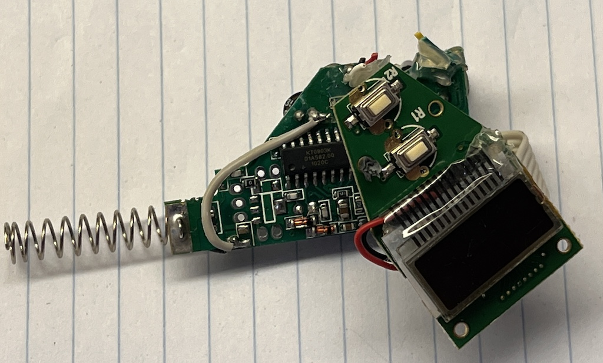

# Liquid crystals 7 segments display

This is salvaged from a car FM transmitter.
4 digits, one dot like `123.4` and one MHZ symbol that is controlled by the dot of the last digit.

30mA current consumption, I suspect it all goes to the backlight.




## Pinout


## Buttons

Buttons short their line to GND i.e. need to pull up on the MCU side with a resistor to limit the current

## Protocol

Some custom shift register style protocol. 12bit words. MSB first. 

* CS line is active low
* 1Mhz clock speed is OK

This is not an SPI, although it looks like it.


The initialization part is important, but the sequence looks cryptic. Without this sequence display stays blank


Notice that it's 3 different commands. I tried all possible combinations of bits. Got weird effects, but nothing useful.

Sending data is straightforward. 12bits per digit, the lowest digit goes first. Each command is prefixed by `0xAA` byte.


Within 12-bit word, 8 bits are used to control segments. The other appears to be not connected.

```
const int segment_b =  0b010000000000;
const int segment_c =  0b001000000000;
const int segment_dp = 0b000100000000;
const int segment_g =  0b000001000000;
const int segment_d =  0b000000100000;
const int segment_a =  0b000000010000;
const int segment_f =  0b000000000100;
const int segment_e =  0b000000000010;
```


# Code example

See the [basic example](examples/basic.cpp)

To display an arbitrary symbol - assemble an `int` from segments and call `display_symbols(...)`.

Take a look at a [neat web interface](examples/webSerial.html) and [matching MCU code](examples/webSerial.cpp).  
See https://wicg.github.io/serial/
It only works in Chrome and Edge, https://caniuse.com/web-serial but it's worth it.

# Reverse engineering notes

To guess bit's meaning - invest time in a tool that makes trial-n-errors visual, it took me a day to make webSerial work and then 3 minutes to decode commands.